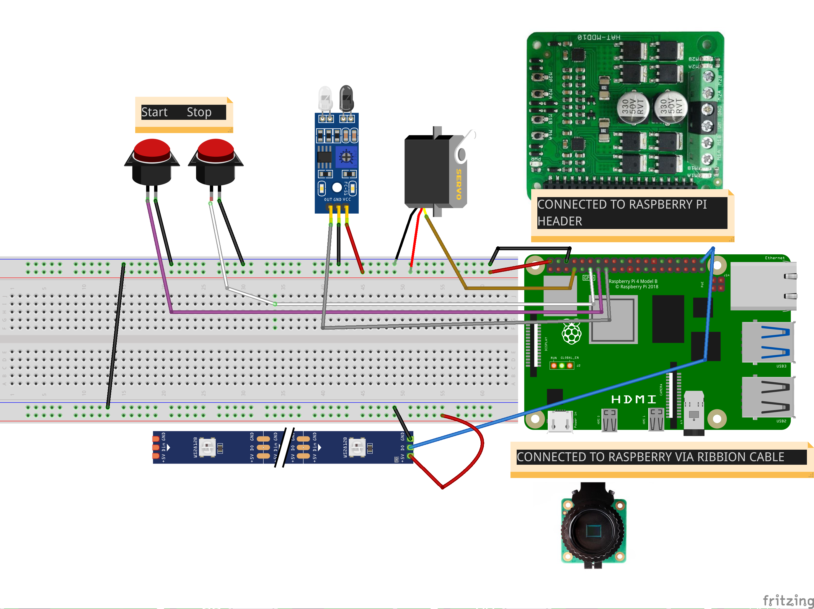

<p align="center">
  <a href="" rel="noopener">
 </a>
</p>

<h3 align="center">Automatic Centrifuge</h3>

<div align="center">

[]()


</div>

---


<p align="center"> Automatic Centrifuge
    <br> 
</p>

## 📝 Table of Contents

- [About](#about)
- [Getting Started](#getting_started)
- [RPiClient Installation](#Installation)
- [Circuit](#circuit)
- [Usage](#usage)
- [Built Using](#built_using)
- [Authors](#authors)


## 🧐 About <a name = "about"></a>

This repo contains

- Backend
- RPiClient Software
- Client auto-Installer script
- Detailed instructions

for IoTManagement System.


## Getting Started <a name = "getting_started"></a>

These instructions will get you a copy of the project up and running on you raspberry pi.

### Prerequisites

Turn on your Raspberry Pi and execute the following commands

```
- sudo apt update
- sudo apt upgrade
```

## RPiClient Installation <a name = "Installation"></a>


### Auto Installer
To install and Run RPi Client Automatically just run the following command on your Raspberry Pi terminal

- ```curl -sSL  https://raw.githubusercontent.com/Nauman3S/IOTManagementSystem/main/installer.sh  | bash```

After the installer completes the process, note down the MAC Address on the terminal with success message.

### Configuring Camera

1.  Start your Raspberry Pi
2.  Go to the main menu and open the Raspberry Pi Configuration tool.


3.  Go to the main menu and open the Raspberry Pi Configuration tool.
   


4.  Reboot your Raspberry Pi.


## Circuit <a name = "circuit"></a>


### Motor Driver Details

```http
Motor Driver Header Pins(already connected to the Raspberry Pi)
```

| MotorDriverPin | RPi Pin | Description | 
| :--- | :--- | :--- |
| `PWM1` | `GPIO12` | *Already connected via header*  |
| `DIR1` | `GPIO26` | *Already connected via header*  |
| `PWM2` | `GPIO13` | *Already connected via header*  |
| `DIR2` | `GPIO24` | *Already connected via header*  |


```http
Motor Driver Pins for connecting motors
```

| MotorDriverPin | Description | 
| :--- | :--- |
| `M1A` | *Connect to motor1 terminal A*  |
| `M1B` | *Connect to motor1 terminal B*  |
| `VM`  |  *Positive Supply (6V to 24V)*  |
| `GND` | *Negative Supply*  |
| `M2A` | *Connect to motor2 terminal A*  |
| `M2B` | *Connect to motor2 terminal B*  |


### Raspberry Pi Pinout


Follow the pinout diagram given below to connect different components to your Raspberry Pi


### Other Components

```http
Other components pin connection details
```

| MotorDriverPin | RPi Pin | Description | 
| :--- | :--- | :--- |
| `START BUTTON` | `GPIO27` | *To start the rotation*  |
| `STOP BUTTON` | `GPIO17` | *To stop the rotation*  |
| `IR Sensor` | `GPIO22` | *To start centrifuge without physically touching anything*  |
| `Servo` | `GPIO4` | *If it won't work, power it from an external 5v power source*  |
| `LED R` | `GPIO19` | *RGB LED*  |
| `LED G` | `GPIO6` | *RGB LED*  |
| `LED B` | `GPIO5` | *RGB LED*  |

### Complete Circuit Diagram

Here's the complete circuit diagram of the system.



## Usage <a name = "usage"></a>

1.  Run installer script on your Raspberry Pi.
2.  Note down the MAC Address given by the installer script at the end.
3.  Add the device with the MAC Address collected in the previous step to the database using addDevice API endpoint mentioned above
4.  Interact with the device with using MAC Address, or interact with all the devices in the system by using `all` in devices parameter of the API.


## List of Components <a name = "list"></a>

Following components are used to make this project

1.  Push Buttons(Generic)
2.  IR Obstacle Avoidance Sensor (https://www.amazon.co.uk/Electrely-Avoidance-Photoelectric-Reflection-Detecting-Green/dp/B07G38MXW8/ref=sr_1_6?dchild=1&keywords=ir+sensor&qid=1631010821&sr=8-6)
3.  Servo Motor(https://www.amazon.co.uk/ZHITING-2-Pack-MG996R-Digital-Helicopter/dp/B088NJRFD7/ref=sr_1_6?dchild=1&keywords=servo+motor&qid=1631011601&sr=8-6)
4.  6-24V 10A Motor Driver HAT (https://www.robotshop.com/en/cytron-2x10a-motor-driver-hat-for-raspberry-pi.html)
5.  RGB LED Module KY-016(https://www.amazon.co.uk/KY-016-Colors-Sensor-Arduino-Starter/dp/B07MFSWMQM/ref=sr_1_1?dchild=1&keywords=rgb+led+module+ky-016&qid=1631011646&sr=8-1)


## ⛏️ Built Using <a name = "built_using"></a>

- [Python](https://www.python.org/) - For programming RPi Client
  
<!-- ## Demo Videos <a name = "demo"></a>

- Complete Demo Part 1: https://youtu.be/d15zIwMxJ3w
- - This is a part 1 of complete demo of IoT Management System, showing how to install the Client on Raspberry Pi and run it.
- Complete Demo Part 2: https://youtu.be/kUgdPix0l-g
- - Part 2 of complete demo showing how to interact with all the devices or specific devices in the system using API. -->

## ✍️ Authors <a name = "authors"></a>

- [@Nauman3S](https://github.com/Nauman3S) - Development and Deployment
